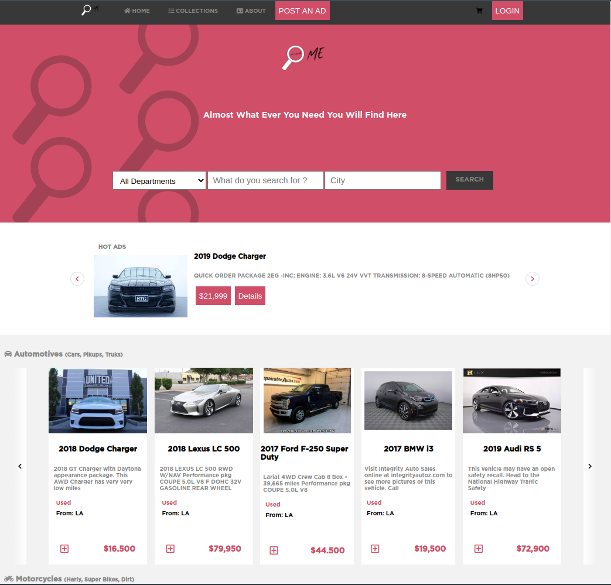

# Search Me

### hireable


<!-- PROJECT LOGO -->
<br />
<p align="center">
  <a href="#">
    
  </a>

  <h3 align="center">SearchMe</h3>

  
</p>


<!-- TABLE OF CONTENTS -->
## Table of Contents

* [About the Project](#about-the-project)
  * [Built With](#built-with)
* [Getting Started](#getting-started)
  * [Installation](#installation)
* [Usage](#usage)
* [Contributing](#contributing)
* [License](#license)
* [Contact](#contact)
* [Acknowledgements](#acknowledgements)


<!-- ABOUT THE PROJECT -->
## About The Project



This project serves as online used Automotives and Automotives services Shop with the ability to search throw variant of choices that suits you and your needs almost all that you need.

This project made as a part of the HTML/CSS capstone project for Microverse Special thanks to the author Mohammed Awad.

[Live Demo Link](https://raw.githack.com/sanadwj/HTML-CSS-capstone-project/feature-branch/main-page.html)


### Built With

* FlexBox
* Grid


<!-- GETTING STARTED -->
## Getting Started


### Installation


1. Clone the repo
```sh
git clone https://github.com/sanadwj/HTML-CSS-capstone-project.git
```
2. Open main-page.html in your browser 

3. Enjoy


<!-- USAGE EXAMPLES -->
## Usage

This project serves as online used Automotives and Automotives services Shop


<!-- CONTRIBUTING -->
## Contributing

Contributions are what make the open source community such an amazing place to be learn, inspire, and create. Any contributions you make are **greatly appreciated**.

1. Fork the Project
2. Create your Feature Branch (`git checkout -b feature/AmazingFeature`)
3. Commit your Changes (`git commit -m 'Add some AmazingFeature'`)
4. Push to the Branch (`git push origin feature/AmazingFeature`)
5. Open a Pull Request


<!-- LICENSE -->
## License

Distributed under the CC License. See `LICENSE` for more information.


<!-- CONTACT -->
## Contact

👤 **Sanad Walid Abujbara**

- Github: [@sanadwj](https://github.com/githubhandle)
- Twitter: [@sandooog](https://twitter.com/sandooog)
- Linkedin: [sanad-abujbara](https://linkedin.com/in/sanad-abujbara)


## Show your support

Give a ⭐️ if you like this project!

## Acknowledgments

- Microverse
- Microverse Team 139 (The Thanatos)
- author Mohammed Awad


